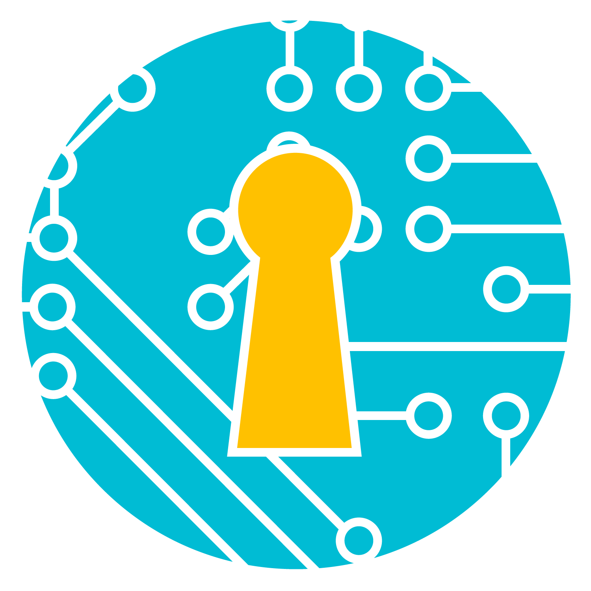

<p align="center"></p>
<h1 align="center">Runlog</h1>
<p align="center"> by <a href="https://scrthq.com">Secret Headquarters</a></p>
<p align="center"><a href="https://www.reddit.com/r/runlog_scrthq/"></a> <a href="https://discord.gg/ZwWeRCaV5J"></a></p>

An engine for dice-driven creative-practice games — the kind where you roll on
a table, take whatever constraint comes up, make something under it, and
occasionally suffer a result that reaches backwards and damages what you made
an hour ago.

Games like that are usually played on paper, and the bookkeeping is what
breaks. Backwards targeting is fiddly arithmetic done mid-session while your
attention is on the work. Persistent states pile up invisibly. Counters run in
the background. Deferred results — "after you finish, roll a d6" — are simply
forgotten. None of that is the interesting part of the game, and all of it is
what a computer is for.

**Runlog is a referee and a run log, not a rulebook.** It does not know what
game you are playing. It reads a *pack* — a YAML or JSON file describing your
tables, states, counters, flow and modes — and becomes that game: every noun on
screen comes from your vocabulary, every step from your flow. It never judges
the work itself, because it cannot see it.

Everything runs in the browser, and nothing leaves your machine unless you
sign in. There is no account you have to have.

---

## Try it

```bash
npm install
npm run dev
```

Eleven packs ship with it, free, in the catalog. Four are for anyone with a
day, a house, a skill or a kitchen — the app is usable out of the box, not
only by people who write packs — and the rest are structurally different on
purpose: if they did not need different features, the format would not be
proving anything.

| Pack | Shape | What it exercises |
| --- | --- | --- |
| Any Given Day | a day of things to do; the pack a new device gets | weather that reaches back, a streak, energy, favors, a two-to-four-player mode |
| Homefront | housework as a dungeon crawl | the subject drawn from a table, patience as a resource, timed rooms |
| Practice Room | deliberate practice for any skill | timers as the spine, a required journal line, a run-end `bands` roll |
| Pantry Roulette | cooking under constraint | two draws per course, a cook-and-critic pair, forced extra courses |
| The Long Kiln | ceramics, dungeon-shaped | backwards targeting, decks, counters, co-op, seeded runs |
| Salt & Signal | solo journaling | `bands` resolution, progress tracks, free-text journal |
| Ladder Work | training log | no targeting at all, runs spanning days, timers |
| Rocket League: Mechanics Ladder | a challenge pack for a game | ladder, quick, endless and shared modes |
| Elden Ring: Expedition | a challenge pack for a game | draws that draw again, vows, up to ten players |
| Rocket League: Showdown | a moderated race | one person moderates, a roster races the drawn mechanics, points by rank |
| Elden Ring: Trial | a moderated race | curses that land on everyone with a cure drawn beside them, targets worth points |

## The guide

The app carries its own guide — how to play, how to share a run, how to
design a pack, where the documents are — under Menu, or at `#guide` on any
address. It needs no account. The pages are MDX in `apps/web/src/guide/pages`,
with screenshots in `apps/web/public/guide` and live pieces of the app where
a picture would go stale.

## Write your own

```bash
npx @scrthq/runlog init my-game.yaml
npx @scrthq/runlog validate my-game.yaml --strict
npx @scrthq/runlog test my-game.yaml          # replays the fixtures your pack ships
```

- **[The authoring guide](docs/authoring.md)** — why you would reach for any of
  it, with a complete pack you can copy.
- **[The reference](docs/reference.md)** — every field, generated from the
  schema, so it cannot be wrong about what loads.
- **[The stream API](docs/stream-api.md)** — a shared run as one JSON
  document and a socket that rings, for a plugin of your own.

Point your pack at the published schema and your editor does most of the work:

```yaml
# yaml-language-server: $schema=https://runlog.dev/schema/pack-1.schema.json
```

---

## What is in here

```
packages/
  rules-schema/   The contract. Zod definitions, the published JSON Schema, the linter.
  engine/         Pure TypeScript. Events, reducer, targeting, triggers. No DOM.
  cli/            validate · bundle · test · init · sign · release. What a designer runs in CI.
apps/
  web/            The React app.
packs/
  demo/           The reference pack. Fictional.
  sketches/       Two more, deliberately unlike it.
docs/             The authoring guide, and the generated reference.
```

Two design decisions explain most of the rest:

**A run is its event log.** State is a fold over the events, never stored
directly. That is what makes undo, exact replay, shared seeds and a
round-tripping export all the same feature rather than four.

**Packs are data, never code.** The action vocabulary is closed and small, the
predicates are a whitelist, and there is no scripting and no `eval` anywhere —
packs come from strangers. If a pack needs something the actions cannot
express, it writes a `note`: an instruction the player carries out by hand and
ticks off. The app is a bookkeeper, not an enforcer.

## Where it runs

The bare address is the welcome page, which says what Runlog is; the app is
under `/play`, and any deep link (a live link, a guide page, an invitation)
opens the app wherever it points. **Skip this page next time**, at the foot
of the welcome page, makes the bare address the app on that device. A copy
opened from disk is always the app.

| | |
| --- | --- |
| Hosted | https://runlog.scrthq.com — the copy Secret Headquarters runs, with accounts, sync, tables with company and the catalog |
| Anyone, no account | https://scrt-hq.github.io/runlog/ — GitHub Pages, tracks `main`, no sign-in and no sync |
| Your own | [docs/self-hosting.md](docs/self-hosting.md): on your machine, on a static host, or on your own AWS |

Static files on S3 behind CloudFront, and behind `/api` on the same origin a
small server for the parts that outlive one device: accounts, sync, tables
with company, the catalog. All of it is in this repository: the app under
`apps/` and `packages/`, which runs without any of the rest, and the hosting
under [`hosted/`](hosted/README.md), which is what makes one address a
service. One pipeline builds the app, lays the hosted pages over it, and
deploys the hosting with the build.

| Trigger | What runs |
| --- | --- |
| Pull request to `main` | The suite, the packs, a build; the hosting's tests; a diff of the stacks, staging and hosted |
| Push to `main` | Build, deploy a staging copy (the site stack publishes the build), seed its catalog, then tag and publish the next release |
| Release published | Build the tag, deploy the hosted copy |
| Hosted deploy succeeded | The same run publishes `@scrthq/runlog` at the tag's version to npm, under `next` until the `NPM_CHANNEL` variable says `latest`; OIDC from the `npm-publish` environment, no token |
| Push to `main` | Build and deploy the no-account version to GitHub Pages |
| Monday mornings | Dependabot opens one pull request for the week's minor and patch bumps, one per major, and one for the workflows' actions, each for versions at least a week old; a security advisory opens one whenever it lands |

The hosted copy is reached only through a published release, so it always
carries a version and has always already been through staging.

It also still runs from a file. `npm run build`, then open
`apps/web/dist/index.html` — which is the zero-friction path when the app is
sitting next to whatever you are working in. To run a copy of your own, on
your machine, on a static host, or on your own AWS with accounts and sync,
see [docs/self-hosting.md](docs/self-hosting.md); none of the three needs a
fork.

### How it looks

Two voices. The pack's author speaks in a book serif, Literata, because the
rules are a rulebook. The player speaks in the same face in italic, because a
name is a note in the margin. The referee — the app — speaks in IBM Plex Mono,
because it keeps a ledger and its figures have to line up. Both faces ship in
the bundle: the hosting's Content Security Policy allows no font host, and the
worker precaches them like everything else.

Two accents with one job each: celadon is the referee's "fine", kiln amber is
consequence. Four looks share every other decision and differ only in the
ground — lights down, daylight, ember and glaze — chosen from the header and
remembered on this machine. With no choice made, the operating system's
preference picks between the first two.

### Signing in

Signing in is an offer, never a door. Every address opens straight into the
app, and everything the app does happens on your machine whether or not you
have an account. Where a build knows a [WorkOS AuthKit](https://workos.com/docs/authkit)
client, the header offers "Sign in"; the app never sees a password. An account
unlocks sync, which is on once you have; a switch in the menu on your name
turns it off for this device, and a light there says which it is.

Signed in, your name in the header is a menu: this device's sync switch,
your profile, and sign-out. The
profile page shows who the account is, this device's sync switch and what has
travelled, the license keys the account holds (shown or copied on purpose,
hidden by default), and one destructive control that tells the server to
forget everything of yours. What is on the device stays on the device.

A run's log is append-only once it has been to your account: each move is
sent as the events it made, the server numbers them in the order it received
them, and every device replays the same list. Undo is an event too, naming the
move it voids, so it never shortens a log another device has built on. That is
the ground a shared session stands on, and solo play is the same protocol
with one writer.

The bar holds three things: the pack in play, which opens your library; a
Rules button that shows the pack's tables and flow; and one menu, with the
sync switch, your profile, the pack designer, the theme, and the doors in and
out. Nothing else lives up there, so a phone's screen is the run.

The pack's name in the bar opens your library: your packs, newest played
first, with each pack's runs beneath it. Continue any run, start another
without disturbing the one that is open, forget one, or load a pack from a
file. Nothing ships in the library; the catalog is where packs come from — laid
out as a market, with a sidebar that narrows by category, tag and how a pack
plays (solo, together, moderated, seeded), all read from the packs themselves.
The packs that come with the app are there, free, and a device that has
never had a pack gets Any Given Day once so Play works straight away. A
catalog pack's text is public, so it syncs to your account without asking.

Each device has one run open per pack, and it stays open through browsing:
Inspect, another pack, the profile, a closed tab all leave it where it was,
and Play returns to it. The bar's run picker lists every run of the pack on
this device, switches between them, and starts another without touching the
open one. Signing in on a device with nothing open lands on the run your
account touched last, and "Continue where you left off" in the menu on your
name does the same on demand. While a run is open and the tab is visible, the
device asks after the others every ten seconds.

A run can be shared. The People panel beside the board lists who is at the
table; the owner invites someone by email, as a player or a watcher, and the
people you have played with before are offered as you type. The invitation is
a link: whoever opens it sees whose table it is, signs in, joins, and the run
appears on their devices. A watcher sees every move as it is made and makes
none. The owner can withdraw an invitation or remove a member.

What sync carries: your runs; a pack's text only where you tick "keep this
pack in sync" on the shelf; and the license keys you have typed to open sealed
copies, so the same file opens on your other devices without the receipt. A
sealed copy's text itself never travels — the key does, the file is yours to
carry, and the server never sees what was inside it.

The build knows whether there is anything to sign into from one variable:

| | |
| --- | --- |
| `VITE_WORKOS_CLIENT_ID` set | "Sign in" in the header. Set by the deploy from the stage environment's `WORKOS_CLIENT_ID` variable. |
| unset | No sign-in at all, and no request to WorkOS. Local development, the test-suite, a file on disk and the public GitHub Pages build all run this way. |

To work on sign-in locally, put the staging client id in `apps/web/.env.local`
and run `npm run dev`; `http://localhost:5173/` is a registered callback. To
have an API as well, set `VITE_RUNLOG_API_ORIGIN` there to a hosted Runlog
(the dev site, say): the dev server proxies `/api` and `/ws` to it, so live
links, widgets by link, sync and purchases work at localhost as they do
hosted, against that site's data. `apps/web/.env.example` shows both.
Anything else the app talks to has to be named in the Content Security Policy
in `hosted/infra/lib/site-stack.ts`, and today that is `api.workos.com` alone.

The designer can start from a pack you already have — one from the library
or the catalog whose license allows changed copies — as a new pack of your
own with the original credited in its notice. And it can sign a release or
seal a copy for a buyer in the browser: make or drop in a signing key (it
never leaves the page), claim it as your account's so the app names you, then
download the signed pack or the sealed `.rlpack` with its license key.

## Signing

A pack can carry a signature proving it is unchanged since its author signed it:

```bash
npx @scrthq/runlog keygen -o my-key.json
npx @scrthq/runlog sign my-game.yaml --key my-key.json --as "Your Name"
```

This proves authorship, not ownership. It does not restrict copying and cannot —
the app must read every word of a pack to play it. What it gives an author is
that an altered copy can no longer claim to be theirs, and what it gives a
player is a fingerprint to compare against one the author published. See
[the authoring guide](docs/authoring.md#signing-and-what-it-does-not-do).

## Selling copies

```bash
npx @scrthq/runlog issue my-game.yaml --to "Buyer" --ref order-1 --key my-key.json --seal
```

One file per buyer, stamped with their name and sealed behind a license key.
The stamp lives inside the signature, so removing it breaks verification; the
seal means the distributed file is binary rather than YAML and is inert without
the key. It raises the cost of the leak that actually happens — a text editor
and thirty seconds — and makes no claim beyond that. See
[the authoring guide](docs/authoring.md#selling-copies), and
[selling from your own backend](docs/selling.md) for the container format and
the sealing API in the `@scrthq/runlog` package, which any checkout can call.

## License

MIT, for everything in this repository: the engine, the schema, the app, the
command line and the docs. See [LICENSE](LICENSE). The packs you write with
it are yours, under whatever license their own `license` field says.

## Licensing, and what is deliberately absent

This repository is a general engine. It contains no particular game.

That is not incidental. This was built alongside a game whose rulebook forbids
reproducing or adapting it, so the architecture answers that structurally
rather than hopefully: the engine here is general, any transcription lives in a
gitignored private pack, and the two only ever meet in one person's browser.
`tests/license-boundary.test.ts` enforces it against what git actually tracks.

Packs carry their own license, and the app honors it: a pack marked
`redistributable: false` never has its text embedded in an export meant for
anyone else — a shared log records *which* results came up without quoting what
they say. A copy you keep for yourself quotes them in full, because personal
use is what such a license allows.

## Contributing

`.npmrc` asks npm not to install a package version younger than a week, so
a compromised release has time to be noticed before it reaches anyone
here. npm 11.10 and later enforce it; an older npm ignores the line.

See [CONTRIBUTING.md](CONTRIBUTING.md). Runs, packs and questions that
are not bugs go to [r/runlog_scrthq](https://www.reddit.com/r/runlog_scrthq/) or
[the Discord server](https://discord.gg/ZwWeRCaV5J).
